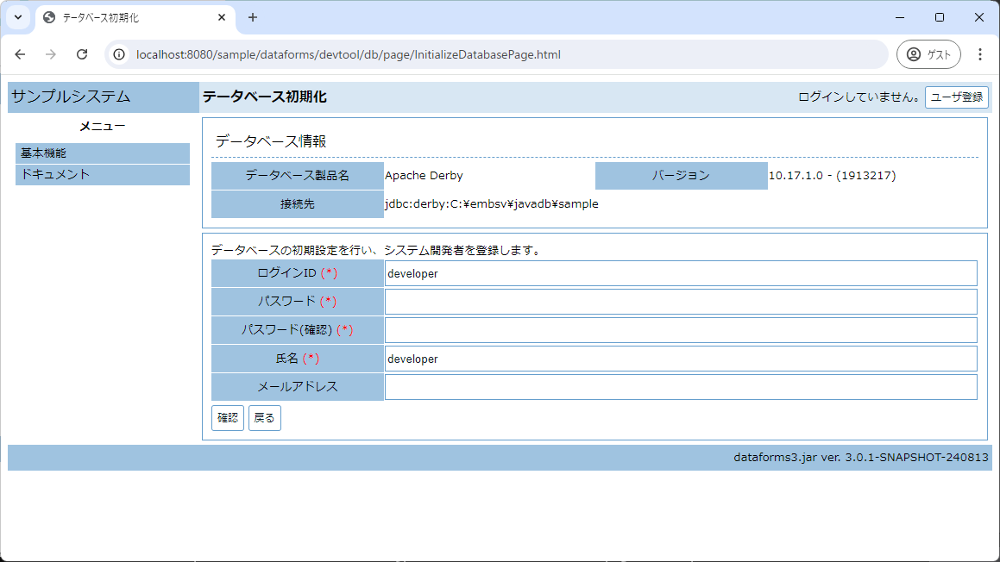

# embsv.jar アプリケーションサーバ組み込みツール
## Description

embsv.jarはまだ開発中です。

dataforms3.jarで作成したwarファイルを実行するには、Apache Tomcat10以上と何らかのデータベースサーバを用意する必要があります。
これらのサーバ構築には専門知識が必要になるため、有用なwarファイルを公開しても専門家でないと利用することができません。
そこでTomcat10 Embedded(Webアプリケーションサーバ)とApache Derby(Javaで作成されたデータベースサーバ)をwarファイルに組み込むツールを作成しました。

このツールで処理したwarファイルは、Java21以上をがインストールされた環境であれば、Tomcatやデータベースサーバをインストールせずに実行することができます。

## Requirement
* Java21
* Tomcat10 + Apache Debyで動作するJava Web アプリケーション(*.warファイル)。

## Licence
[MIT](https://github.com/takayanagi2087/dataforms/blob/master/LICENSE)

## Usage

適当なディレクトリにembsv.jarとdataforms3.jarで作成したWebアプリケーション(この例ではsample-0.0.1-SNAPSHOT.war)をコピーします。


```
 C:\embsv のディレクトリ

2024/08/16  15:33    <DIR>          .
2024/08/16  12:28        17,043,920 embsv.jar
2024/08/16  12:13        59,747,686 sample-0.0.1-SNAPSHOT.war
```

sample-0.0.1-SNAPSHOT.warにアプリケーションサーバを組み込んだsample.warを作成。

```
C:\embsv>java -jar embsv.jar -emb sample-0.0.1-SNAPSHOT.war sample.war
2024/08/16 15:41:01.495 [main] INFO   jp.dataforms.embsv.util.JarUtil C:\embsv\sample-0.0.1-SNAPSHOT.war => C:\embsv\webapps\sample-0.0.1-SNAPSHOT
2024/08/16 15:41:01.793 [main] INFO   jp.dataforms.embsv.util.JarUtil C:\embsv\embsv.jar => C:\embsv\webapps\sample-0.0.1-SNAPSHOT
2024/08/16 15:41:03.638 [main] INFO   jp.dataforms.embsv.AppServer 作成中 sample.war
2024/08/16 15:42:16.179 [main] INFO   jp.dataforms.embsv.AppServer 作成完了 sample.war
2024/08/16 15:42:16.179 [main] INFO   jp.dataforms.embsv.AppServer 削除中 C:\embsv\webapps\sample-0.0.1-SNAPSHOT
2024/08/16 15:42:16.179 [main] INFO   jp.dataforms.embsv.AppServer 次のコマンドでWebアプリケーションを起動することができます。
        java -jar sample.war

C:\embsv>dir
 Volume in drive C is Windows
 Volume Serial Number is A8A0-C2E4

 Directory of C:\embsv

2024/08/16  15:39    <DIR>          .
2024/08/16  15:39               965 embsv.conf.jsonc
2024/08/16  12:28        17,043,920 embsv.jar
2024/08/16  15:39    <DIR>          log
2024/08/16  12:13        59,747,686 sample-0.0.1-SNAPSHOT.war
2024/08/16  15:42        76,849,541 sample.war
2024/08/16  15:41    <DIR>          webapps
               4 File(s)    153,642,112 bytes
               3 Dir(s)  2,438,803,484,672 bytes free
```

sample.warを実行。

```
C:\embsv>java -jar sample.war
2024/08/16 15:45:01.482 [main] INFO   jp.dataforms.embsv.util.JarUtil C:\embsv\sample.war => C:\embsv\webapps\sample
情報: Initializing ProtocolHandler ["http-nio-8080"] [金 8月 16 15:45:04 JST 2024]
情報: Starting service [Tomcat] [金 8月 16 15:45:04 JST 2024]
情報: Starting Servlet engine: [Apache Tomcat/10.1.28] [金 8月 16 15:45:04 JST 2024]
情報: No global web.xml found [金 8月 16 15:45:07 JST 2024]
情報: At least one JAR was scanned for TLDs yet contained no TLDs. Enable debug logging for this logger for a complete list of JARs that were scanned but no TLDs were found in them. Skipping unneeded JARs during scanning can improve startup time and JSP compilation time. [金 8月 16 15:45:08 JST 2024]
情報: Starting ProtocolHandler ["http-nio-8080"] [金 8月 16 15:45:09 JST 2024]
2024/08/16 15:45:09.065 [main] INFO   jp.dataforms.embsv.AppServer ブラウザで以下のURLにアクセスしてください。
        http://localhost:8080/sample
```

この状態でブラウザから/localhost:8080/sampleをアクセスすると、データベースの初期化画面が表示される。




WindowsやMacOS等では以下の用に起動することをお勧めします。

```
java -jar sample.war -browser -mode tasktray 
```

このようにオプションを指定すると、Webアプリケーションサーバ起動時に自動的にデフォルトブラウザが起動し、直ぐにWebアプリケーションを利用することができます。
また、タスクトレイに以下のアイコンが表示され、タスクトレイのメニューからブラウザの起動やサーバの停止が可能になります。


## Help
【実行可能warファイルの作成】

```
以下のコマンドで実行可能なwarファイルを作成します。

java -jar embsv.jar -emb <入力warファイル> <出力warファイル>

このコマンドで処理した<出力warファイル>は以下のコマンドだけでWebサーバが起動します。
java -jar <出力warファイル> [option]

起動モード
-mode cmdline           Webサーバのみを起動します。GUIを使用しないモードです。
-mode tasktray          タスクトレイからWebサーバを制御したり、ブラウザを起動することができます。
-mode window            WindowからWebサーバを制御したり、ブラウザを起動することができます。

HTTPのサービスポート
-port <port>            HTTPのサービスポートを指定します。(デフォルト値:8080)

停止コマンドポート
-shutdownPort <port>    停止コマンドのサービスポートを指定します。(デフォルト値:8005)

ブラウザ起動
-browser                Webサーバの起動時にブラウザも起動し、Webアプリケーションをアクセスします。

サーバの停止
-stop                   Webサーバを停止します。

ヘルプ
-help                   この情報を表示します。
```

【Webアプリケーションの実行と停止】

```
以下のコマンドでWebアプリケーションを実行することができます。
java -jar embsv.jar -start <warファイル | Webアプリケーションパス>

以下のコマンドでWebアプリケーションを停止することができます。
java -jar embsv.jar -stop
```

【設定ファイル】
一度Webアプリケーションを起動すると、設定ファイルembsv.conf.jsoncが作成されます。
このファイルにはデフォルトのオプションが設定されています。
環境によって適切なオプションを指定しておけば、起動時のオプション指定が不要になります。

embsv.conf.jsoncの内容。

```
{
	// 起動モードを指定します。
	//   cmdline:GUIを使用しません。
	//   tasktray:タスクトレイモード。
	//   window:ウインドウモード(タスクトレイが使用できない場合使用します。)
	"mode": "cmdline"
	// HTTPのサービスポートを設定します。
	, "port": 8080
	// 停止コマンド用ポートを設定します。
	, "shutdownPort":8005
	// Webアプリケーション起動時にブラウザも起動します。
	, "browser": false
	// 起動ブラウザを固定したい場合は以下の設定を参考にしてください。
	// この設定を有効にすると、Chromeがフルスクリーンモードで起動します。
	// また、デフォルトブラウザが起動しない場合は、このオプションにブラウザのパスを指定してください。
	//, "browserCommandLine": [
	//	"C:/Program Files/Google/Chrome/Application/chrome.exe",
	//	"--start-fullscreen"
	//]
}
```